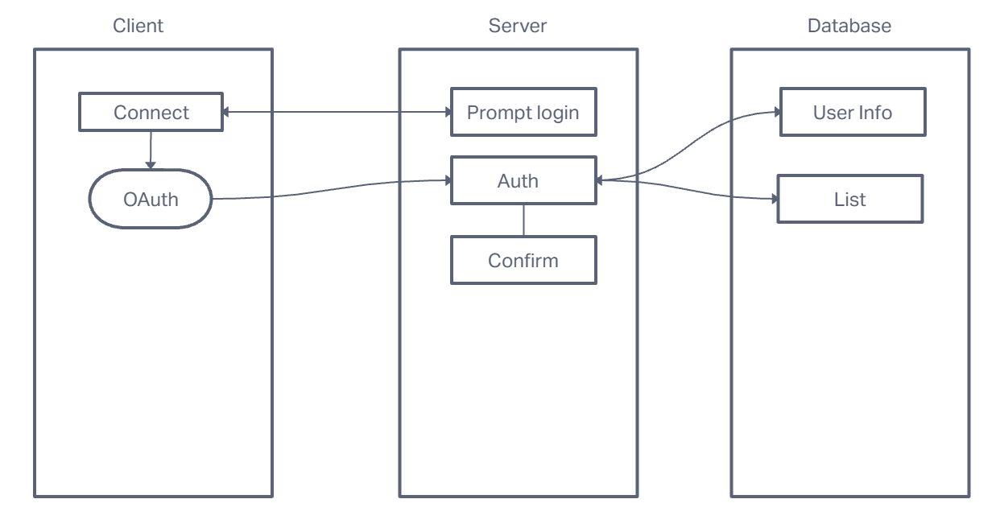
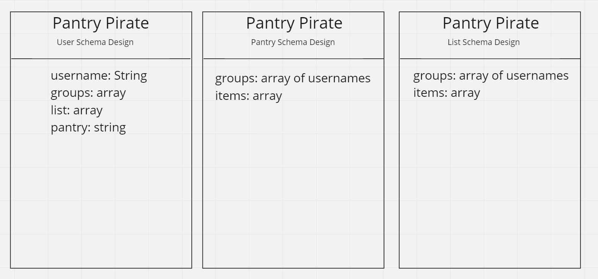

# Pantry Pirate

## Authors: Adrienne Frey, Joe Davitt, Jordan Covington, Jeremy Cleland, Steve Gant

### User Stories

1. As a family member who rotates who does grocery shopping, I would like to share a shopping list with people in my group to easily send a checklist.

2. As a busy homeowner, I want an easy-to-use mobile application to help me keep track of my pantry inventory.

3. As a busy parent shopping for my family, I want to be able to scan a barcode or input an item by description to add to shopping list. 

4. As a user I want a mobile application that allows me to find the best deals so that I can save time and money while managing my groceries.

5. As a user, I want a mobile application that allows me to create groups that are able to share shopping lists.

### Features

### Testing

### UML

